# Task 2
### Create a new database named website.
### Create a new table named member, in the website database.
```sql
CREATE TABLE website.member (
    id BIGINT NOT NULL PRIMARY KEY,
    name VARCHAR(255) NOT NULL,
    username VARCHAR(255) NOT NULL,
    password VARCHAR(255) NOT NULL,
    follower_count INT NOT NULL DEFAULT 0 CHECK (follower_count >= 0),
    time TIMESTAMP NOT NULL DEFAULT CURRENT_TIMESTAMP
);
COMMENT ON COLUMN website.member.id IS 'Unique ID';
COMMENT ON COLUMN website.member.id IS 'Name';
COMMENT ON COLUMN website.member.id IS 'Unique ID';
COMMENT ON COLUMN website.member.name IS 'Name';
COMMENT ON COLUMN website.member.username IS 'Username';
COMMENT ON COLUMN website.member.password IS 'Password';
COMMENT ON COLUMN website.member.follower_count IS 'Follower Count';
COMMENT ON COLUMN website.member.time IS 'Signup Time';
ALTER TABLE website.member
ALTER COLUMN id ADD GENERATED ALWAYS AS IDENTITY;
```
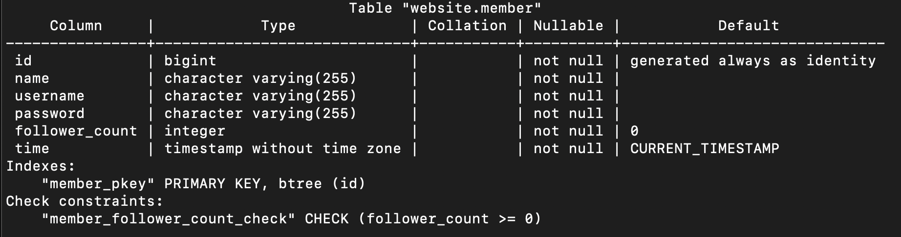</img>
# Task 3
### INSERT a new row to the member table where name, username and password must be set to test. INSERT additional 4 rows with arbitrary data.
```sql
INSERT INTO website.member (name, username, password)
values ('test','test','test');
INSERT INTO website.member (name, username, password)
VALUES ('Apple','apple','123'),
('Banana', 'banaba','123'),
('Kiwi','kiwi','123'),
('Grape','grape','123');
```
### SELECT all rows from the member table.
```sql
select * from website.member
```
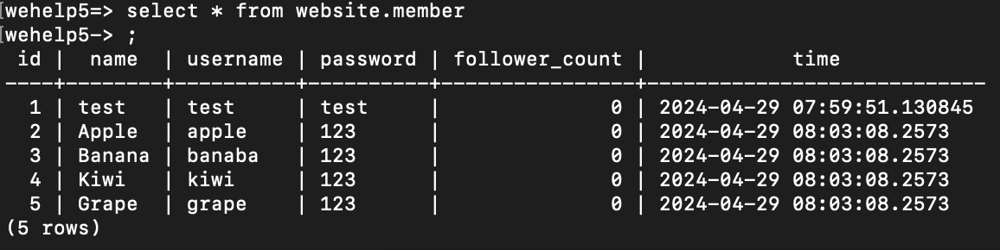</img>
### SELECT all rows from the member table, in descending order of time.
```sql
select * from website.member order by time desc;
```
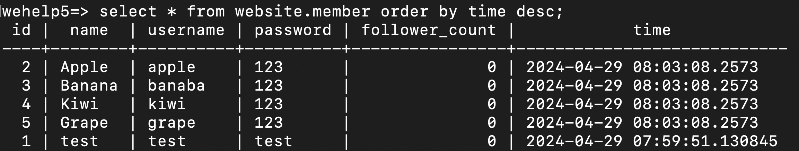</img>
### SELECT total 3 rows, second to fourth, from the member table, in descending order of time.
```sql
select * from website.member limit 3 offset 1 order by time desc;
```
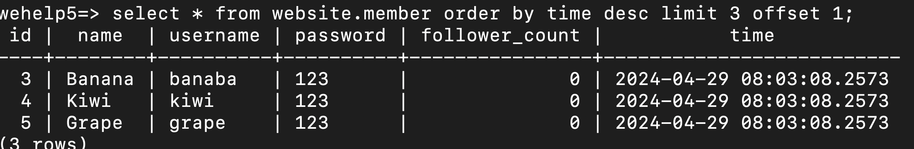</img>
### SELECT rows where username equals to test.
```sql
select * from website.member where username='test';
```
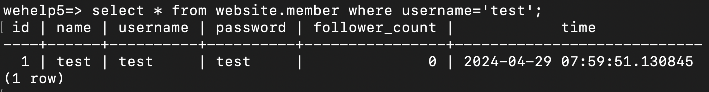</img>
### SELECT rows where name includes the es keyword
```sql
* from website.member where name like '%es%';
```
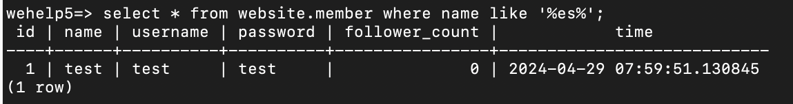</img>
### SELECT rows where both username and password equal to test.
```sql
select * from website.member where username='test' and password='test';
```
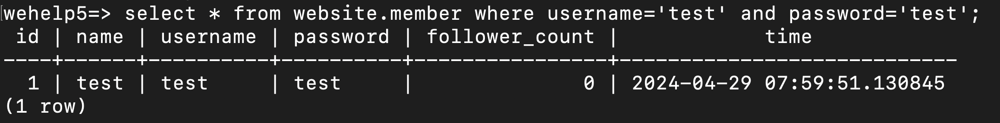</img>
### UPDATE data in name column to test2 where username equals to test.
```sql
update website.member
set name='test2'
where username='test';
```
# Task 4
Assign values to the column of follower_count in the member table. As a result, the table used for task 4 is shown below.
</img>
### SELECT how many rows from the member table.
```sql
select count(*) from website.member;
```
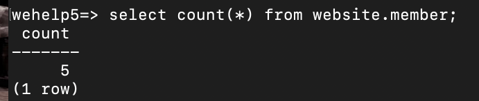</img>
### SELECT the sum of follower_count of all the rows from the member table.
```sql
select sum(follower_count) from website.member;
```
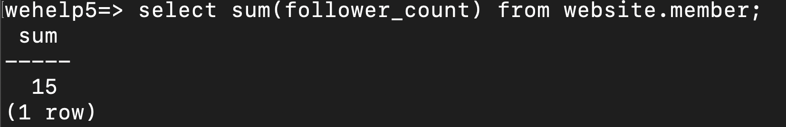</img>
### SELECT the average of follower_count of all the rows from the member table.
```sql
select avg(follower_count) from website.member;
```
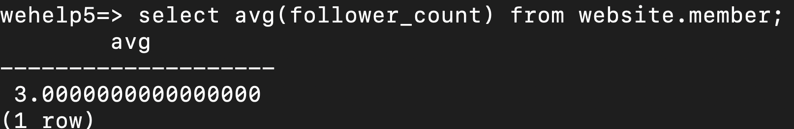</img>
### SELECT the average of follower_count of the first 2 rows, in descending order of follower_count, from the member table.
```sql
select avg(follower_count)as average_followers
from (select follower_count
from website.member
order by follower_count desc limit 2) as top2_followers;
```
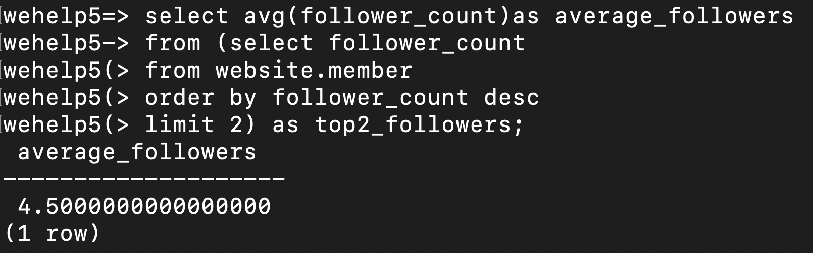</img>
# Task 5
### Create a new table named message, in the website database.
```sql
create table website.message(
id bigint primary key generated always as identity,
member_id bigint not null,
content varchar(255) not null,
like_count int not null default 0 check (like_count >=0),
time timestamp not null default current_timestamp);
comment on column website.message.id is 'Unique ID';
comment on column website.message.member_id is 'Member ID for Message Sender';
comment on column website.message.content is 'Content';
comment on column website.message.time is 'Publish Time';
```
### SELECT all messages, including sender names. We have to JOIN the member table
to get that.
```sql
select * from website.message
inner join website.member on website.message.member_id=website.member.id;
```
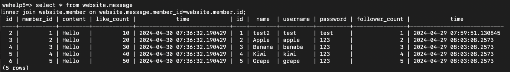</img>
### SELECT all messages, including sender names, where sender username equals to test. We have to JOIN the member table to filter and get that.
```sql
select * from website.message
inner join website.member on website.message.member_id=website.member.id
where website.member.username='test';
```
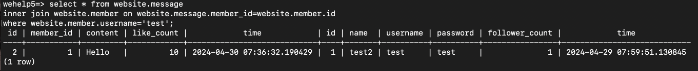</img>
### Use SELECT, SQL Aggregation Functions with JOIN statement, get the average like count of messages where sender username equals to test.
```sql
select avg(like_count) as average_like
from website.message
join website.member on website.message.member_id=website.member.id
where username='test';
```
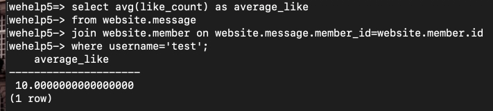</img>
### Use SELECT, SQL Aggregation Functions with JOIN statement, get the average like count of messages GROUP BY sender username.
```sql
select username, avg(like_count) as average_like
from website.message
join website.member on website.message.member_id=website.member.id
group by username;
```
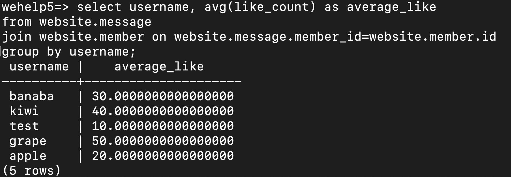</img>

