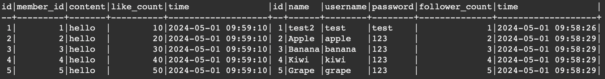
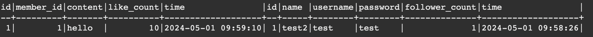

# Task 2
### Create a new database named website.
```sql
CREATE database website;
```

### Create a new table named member, in the website database.
```sql
CREATE TABLE website.member (
    id BIGINT NOT NULL PRIMARY KEY AUTO_INCREMENT COMMENT 'Unique ID',
    name VARCHAR(255) NOT NULL COMMENT 'Name',
    username VARCHAR(255) NOT NULL COMMENT 'Username',
    password VARCHAR(255) NOT NULL COMMENT 'Password',
    follower_count INT UNSIGNED NOT NULL DEFAULT 0 COMMENT 'Follower Count',
    time TIMESTAMP NOT NULL DEFAULT CURRENT_TIMESTAMP COMMENT 'Signup Time'
);
```

# Task 3
### INSERT a new row to the member table where name, username and password must be set to test. INSERT additional 4 rows with arbitrary data.
```sql
INSERT INTO website.member (name, username, password, follower_count)
VALUES ('test', 'test', 'test',1);
INSERT INTO website.member (name, username, password, follower_count)
VALUES ('Apple', 'apple', '123',2),
       ('Banana', 'banana', '123',3),
       ('Kiwi', 'kiwi', '123',4),
       ('Grape', 'grape', '123',5);
```


### SELECT all rows from the member table.
```sql
SELECT * FROM website.member;
```

### SELECT all rows from the member table, in descending order of time.

```sql
SELECT * FROM website.member ORDER BY time DESC;
```

### SELECT total 3 rows, second to fourth, from the member table, in descending order of time.
```sql
SELECT * FROM website.member ORDER BY time DESC LIMIT 3 OFFSET 1;
```

### SELECT rows where username equals to test.
```sql
SELECT * FROM website.member WHERE username = 'test';
```

### SELECT rows where name includes the es keyword
```sql
SELECT * FROM website.member WHERE name LIKE '%es%';
```

### SELECT rows where both username and password equal to test.
```sql
SELECT * FROM website.member WHERE username = 'test' AND password = 'test';
```

### UPDATE data in name column to test2 where username equals to test.
```sql
UPDATE website.member
SET name = 'test2'
WHERE username = 'test';
```

# Task 4
### SELECT how many rows from the member table.
```sql
SELECT COUNT(*) FROM website.member;
```

### SELECT the sum of follower_count of all the rows from the member table.
```sql
SELECT SUM(follower_count) FROM website.member;
```

### SELECT the average of follower_count of all the rows from the member table.
```sql
SELECT AVG(follower_count) AS average_followers
FROM website.member;
```

### SELECT the average of follower_count of the first 2 rows, in descending order of follower_count, from the member table.
```sql
SELECT AVG(follower_count) AS average_followers
FROM (SELECT follower_count
      FROM website.member
      ORDER BY follower_count DESC
      LIMIT 2) AS top2_followers;
```

# Task 5
### Create a new table named message, in the website database.
```sql
CREATE TABLE website.message (
    id BIGINT PRIMARY KEY AUTO_INCREMENT COMMENT 'Unique ID',
    member_id BIGINT NOT NULL COMMENT 'Member ID for Message Sender',
    content VARCHAR(255) NOT NULL COMMENT 'Content',
    like_count INT UNSIGNED NOT NULL DEFAULT 0 COMMENT 'Like Count',
    time TIMESTAMP NOT NULL DEFAULT CURRENT_TIMESTAMP COMMENT 'Publish Time',
    FOREIGN KEY (member_id) REFERENCES website.member(id)
);
INSERT INTO website.message (member_id, content, like_count)
VALUES (1, 'hello', 10),
       (2, 'hello', 20),
       (3, 'hello', 30),
       (4, 'hello', 40),
       (5, 'hello', 50);
```
### SELECT all messages, including sender names. We have to JOIN the member table to get that.
```sql
SELECT * 
FROM website.message 
JOIN website.member ON website.message.member_id = website.member.id
```

### SELECT all messages, including sender names, where sender username equals to test. We have to JOIN the member table to filter and get that.
```sql
SELECT * 
FROM website.message 
JOIN website.member ON website.message.member_id = website.member.id
WHERE website.member.username = 'test';
```

### Use SELECT, SQL Aggregation Functions with JOIN statement, get the average like count of messages where sender username equals to test.
```sql
SELECT website.member.username, AVG(website.message.like_count) AS average_likes
FROM website.message
JOIN website.member ON website.message.member_id = website.member.id
WHERE website.member.username = 'test';
```

### Use SELECT, SQL Aggregation Functions with JOIN statement, get the average like count of messages GROUP BY sender username.
```sql
SELECT website.member.username, AVG(website.message.like_count) AS average_likes
FROM website.message
JOIN website.member ON website.message.member_id = website.member.id
GROUP BY website.member.username
```


